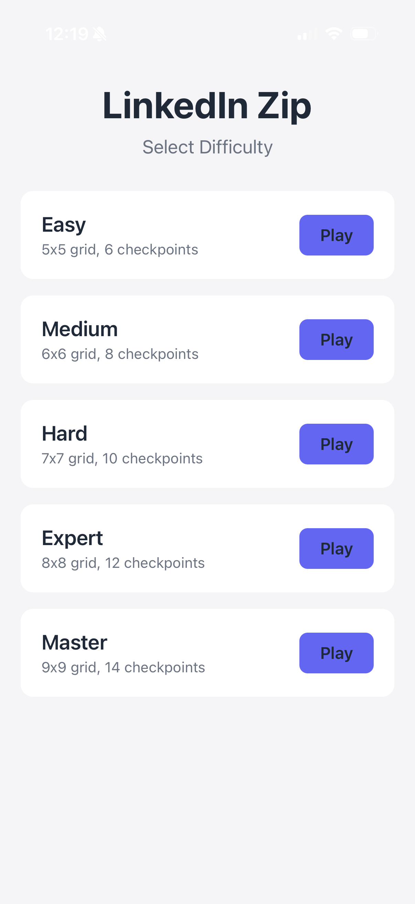
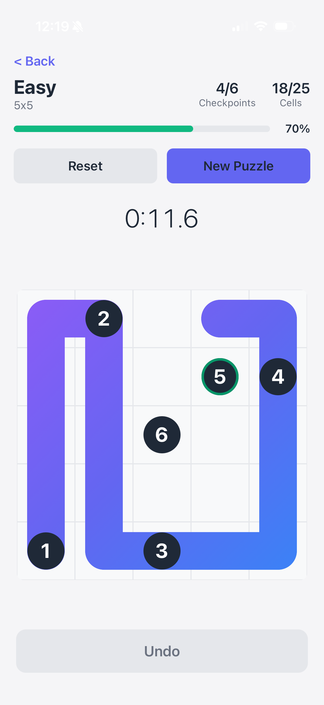
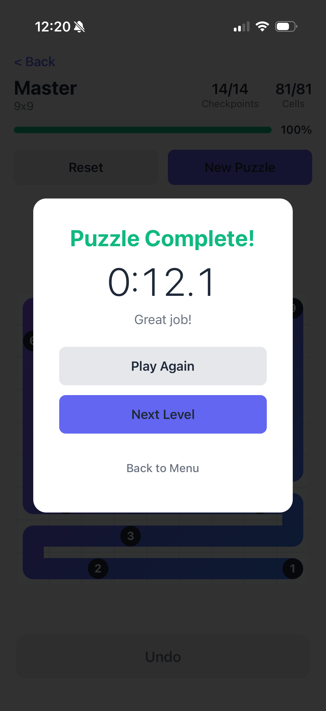

# LinkedIn Zip Clone

A React Native iOS puzzle game inspired by LinkedIn's Zip game. Draw a continuous path through all cells, visiting numbered checkpoints in order.

## Game Rules

1. Start from checkpoint **1**
2. Draw a path visiting checkpoints in order (1 → 2 → 3 → ...)
3. Fill **every cell** on the grid
4. Path can only move to adjacent cells (up/down/left/right)
5. Cannot cross your own path

## Screenshots

| Difficulty Selection | Gameplay | Puzzle Complete |
|:---:|:---:|:---:|
|  |  |  |

## Features

- Multiple difficulty levels (Easy 5x5 to Master 9x9)
- Procedurally generated puzzles using Hamiltonian path algorithm
- Touch and drag path drawing
- Resume from any point on your path
- Undo functionality
- Timer with precision to tenths of a second
- Clean, modern UI matching LinkedIn's style

## Tech Stack

- **React Native** (bare workflow, iOS only)
- **TypeScript**
- **react-native-gesture-handler** - Touch/drag handling
- **react-native-reanimated** - Smooth animations
- **react-native-svg** - Path rendering

## Getting Started

### Prerequisites

- Node.js 18+
- Ruby 3.x
- Xcode 15+
- CocoaPods

### Installation

```bash
# Install dependencies
npm install

# Install iOS pods
cd ios
bundle install
bundle exec pod install
cd ..
```

### Running

```bash
# Start Metro bundler
npm start

# In another terminal, run iOS
npm run ios
```

## Project Structure

```
src/
├── components/
│   ├── Cell.tsx          # Grid cell with checkpoint display
│   ├── Grid.tsx          # Main game grid with gesture handling
│   ├── Path.tsx          # SVG path renderer
│   └── GameHeader.tsx    # Stats, progress, buttons
├── screens/
│   ├── GameScreen.tsx    # Main game screen
│   └── LevelSelectScreen.tsx
├── game/
│   ├── types.ts          # TypeScript interfaces
│   ├── gameState.ts      # Game state reducer
│   └── winChecker.ts     # Win condition logic
├── generator/
│   └── puzzleGenerator.ts # Hamiltonian path generation
├── context/
│   └── GameContext.tsx   # React context provider
└── utils/
    └── colors.ts         # Color palette
```

## How Puzzles Are Generated

1. Generate a Hamiltonian path (visits every cell exactly once) using Warnsdorff's rule
2. Place checkpoints at evenly distributed points along the path
3. First checkpoint at start, last checkpoint at end
4. Player must rediscover the path by visiting checkpoints in order

## License

MIT
